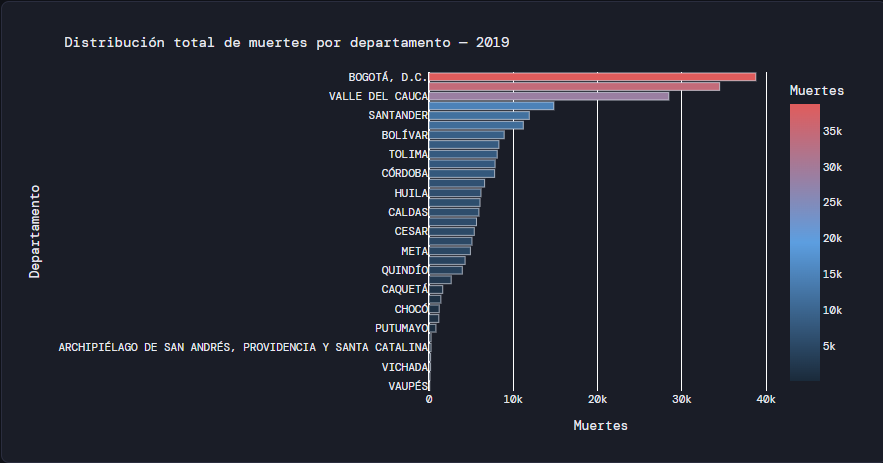
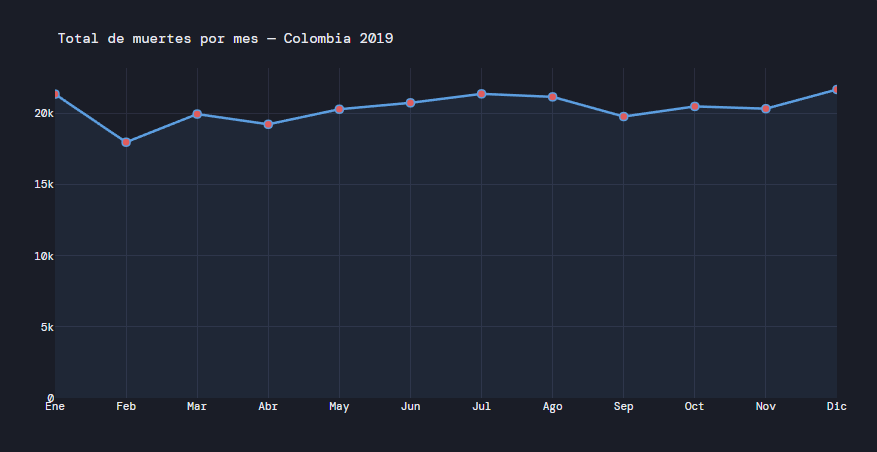
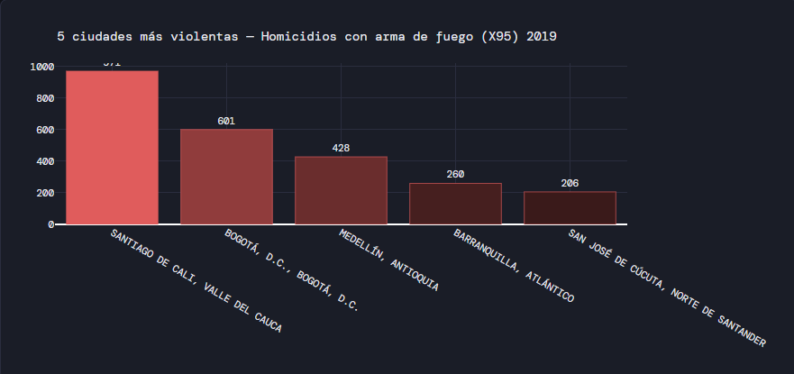
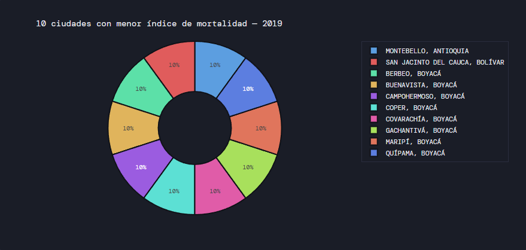
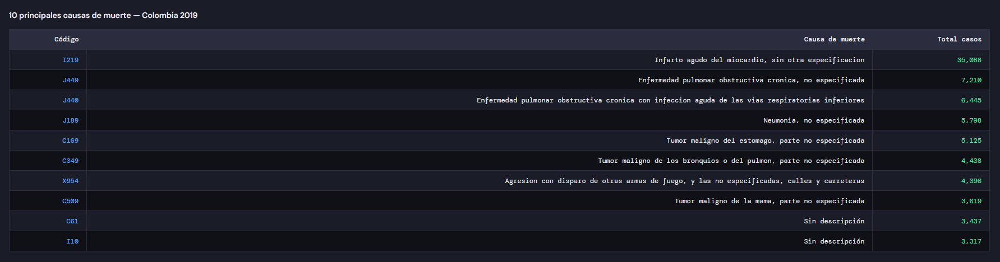
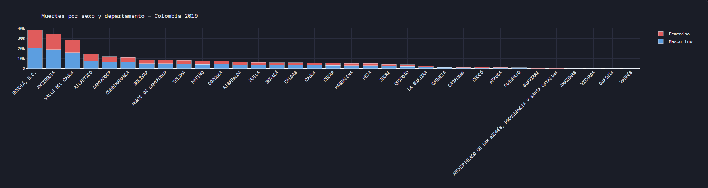
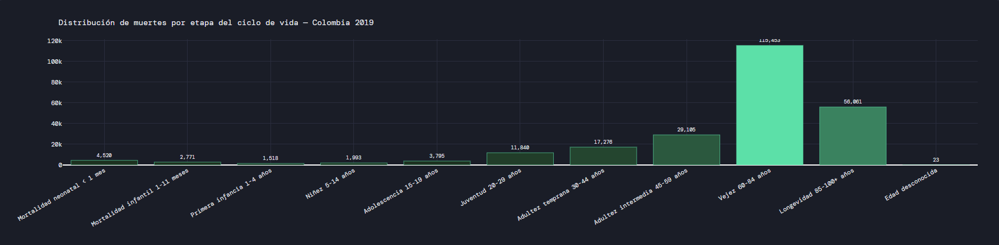

# Análisis de Mortalidad en Colombia 2019

## Introducción

Esta aplicación web interactiva permite explorar y analizar los datos de mortalidad no fetal registrados en Colombia durante el año 2019, utilizando los archivos oficiales del DANE (Departamento Administrativo Nacional de Estadística). La herramienta transforma registros crudos de defunción en visualizaciones comprensibles que facilitan la identificación de patrones demográficos, regionales y temporales.

## Objetivo

Proporcionar una interfaz de análisis visual que permita:

- Identificar la distribución geográfica de la mortalidad por departamento.
- Detectar variaciones estacionales en el número de muertes a lo largo del año.
- Señalar las ciudades con mayor concentración de homicidios con arma de fuego.
- Conocer las ciudades con menor índice de mortalidad absoluta.
- Listar y contextualizar las principales causas de muerte según la CIE-10.
- Comparar la mortalidad entre hombres y mujeres en cada departamento.
- Analizar la distribución de muertes por etapa del ciclo de vida.

## Estructura del proyecto

```
mortalidad_colombia/
├── app.py                  # Aplicación principal Dash
├── requirements.txt        # Dependencias Python
├── Procfile                # Configuración de despliegue para Render
├── .gitignore
├── README.md
├── capturas_informe        # Capturas de pantalla de los elementos gráficos
└── data/                   # Archivos de datos (no incluidos en el repo por tamaño)
    ├── NoFetal2019.xlsx
    ├── CodigosDeMuerte.xlsx
    └── Divipola.xlsx
```


## Visualizaciones e interpretación de resultados

### 1. Mapa — Distribución de muertes por departamento

Muestra la concentración territorial de defunciones mediante un mapa coroplético. Bogotá D.C., Antioquia y Valle del Cauca concentran el mayor número de muertes absolutas, lo que refleja tanto su alta densidad poblacional como su peso en la economía y la urbanización del país.


### 2. Gráfico de líneas — Muertes por mes

Permite identificar estacionalidad en la mortalidad. Los meses de enero y diciembre suelen mostrar picos asociados a temporadas de frío, consumo de alcohol y accidentalidad vial. El gráfico facilita comparar la tendencia general a lo largo del año.


### 3. Gráfico de barras — 5 ciudades más violentas (X95)

Filtra los registros con código CIE-10 X95 (agresión con disparo de armas de fuego, casos especificados y no especificados) y los agrega por municipio. Las ciudades que encabezan esta lista corresponden históricamente a contextos de conflicto urbano o presencia de organizaciones criminales.


### 4. Gráfico circular — 10 ciudades con menor mortalidad

Contrasta con el análisis anterior: muestra los municipios con menor número absoluto de defunciones (con un mínimo de 10 casos para excluir datos atípicos). Son en su mayoría municipios pequeños o de baja densidad poblacional.


### 5. Tabla — 10 principales causas de muerte

Cruza el campo `COD_MUERTE` de los registros de defunción con la tabla de códigos CIE-10 para obtener la descripción de cada causa, ordenadas de mayor a menor frecuencia. Las enfermedades cardiovasculares y respiratorias dominan sistemáticamente la lista.


### 6. Barras apiladas — Muertes por sexo y departamento

Permite comparar la proporción de muertes masculinas y femeninas en cada departamento. En la mayoría de los departamentos la mortalidad masculina supera a la femenina, diferencia que se acentúa en contextos de alta violencia.


### 7. Histograma — Distribución por etapa del ciclo de vida

Agrupa los códigos `GRUPO_EDAD1` del DANE en las categorías definidas por política pública (neonatal, infantil, primera infancia, niñez, adolescencia, juventud, adultez temprana e intermedia, vejez y longevidad). La mortalidad en adultos mayores concentra la mayor parte de los registros, mientras que la mortalidad infantil y neonatal, aunque numéricamente menor, representa un indicador crítico de condiciones de salud pública.


## Requisitos

| Librería     | Versión   |
|--------------|-----------|
| dash         | 2.17.1    |
| plotly       | 5.22.0    |
| pandas       | 2.2.2     |
| numpy        | 1.26.4    |
| openpyxl     | 3.1.2     |
| gunicorn     | 22.0.0    |

Python 3.10 o superior recomendado.

## Instalación local

```bash
# 1. Clonar el repositorio
git clone https://github.com/<usuario>/mortalidad-colombia-2019.git
cd mortalidad-colombia-2019

# 2. Crear entorno virtual
python -m venv venv
source venv/bin/activate        # En Windows: venv\Scripts\activate

# 3. Instalar dependencias
pip install -r requirements.txt

# 4. Colocar los archivos de datos en la carpeta data/
#    NoFetal2019.xlsx, CodigosDeMuerte.xlsx, Divipola.xlsx

# 5. Ejecutar la aplicación
python app.py
```

Abrir http://localhost:8050 en el navegador.

## Despliegue en Render

Los pasos que se siguieron para publicar la aplicación:

1. Crear una cuenta en [Render](https://render.com) y conectarla con GitHub.
2. Hacer clic en **New > Web Service** y seleccionar el repositorio del proyecto.
3. Configurar el servicio:
   - **Environment:** Python 3
   - **Build Command:** `pip install -r requirements.txt`
   - **Start Command:** `gunicorn app:server --bind 0.0.0.0:$PORT --workers 1 --timeout 120`
4. En la sección **Environment Variables** añadir si se desea:
   - `DEBUG=false`
5. Subir los archivos `data/*.xlsx` al servidor mediante el panel de **Disks** de Render (opción de disco persistente) o incluirlos en el repositorio si su tamaño lo permite.
6. Hacer clic en **Deploy**. Render construye el entorno automáticamente y asigna una URL pública.

> El `Procfile` ya contiene el comando de inicio correcto. Render lo detecta automáticamente si está en la raíz del repositorio.

## Software utilizado

- Python 3.11
- [Dash](https://dash.plotly.com/) — framework web para aplicaciones analíticas
- [Plotly](https://plotly.com/python/) — visualización interactiva
- [Pandas](https://pandas.pydata.org/) — manipulación de datos tabulares
- [NumPy](https://numpy.org/) — operaciones numéricas
- [openpyxl](https://openpyxl.readthedocs.io/) — lectura de archivos Excel
- [Gunicorn](https://gunicorn.org/) — servidor WSGI para producción
- [Render](https://render.com/) — plataforma de despliegue (PaaS)
